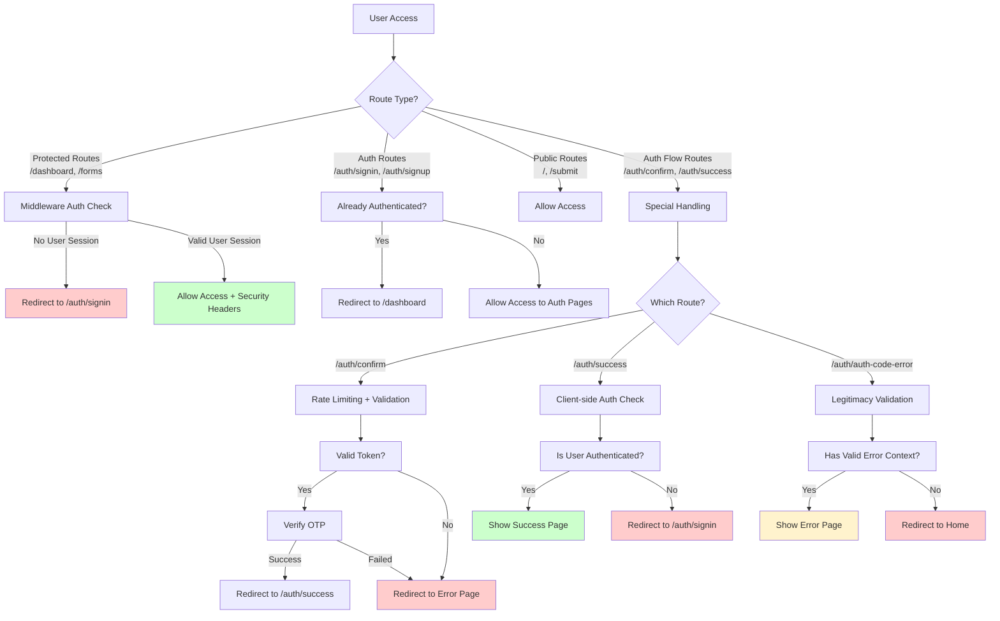
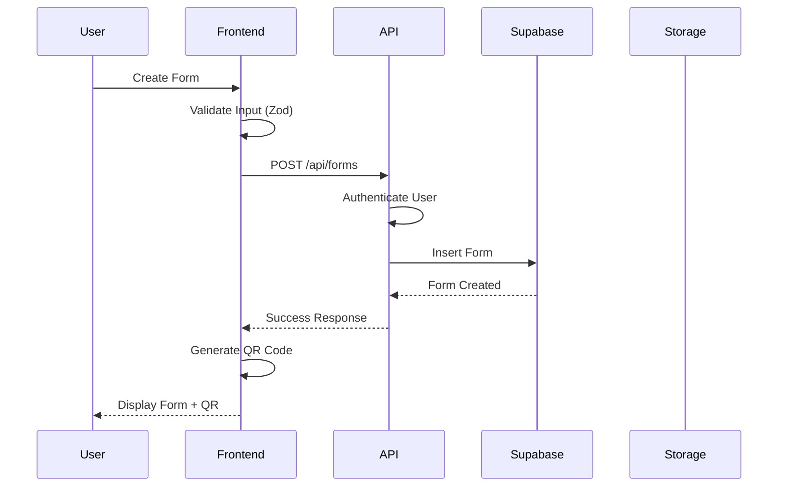
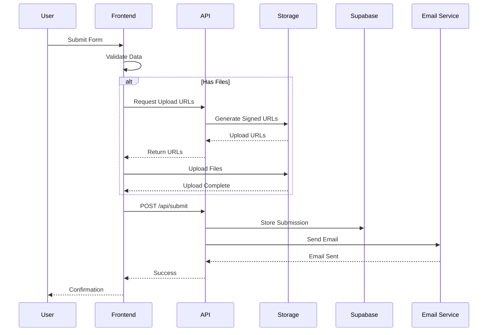
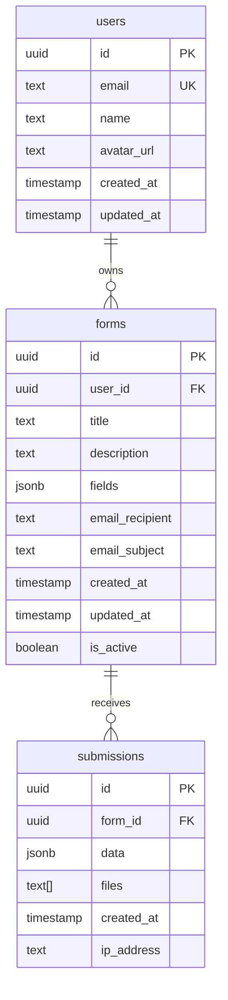
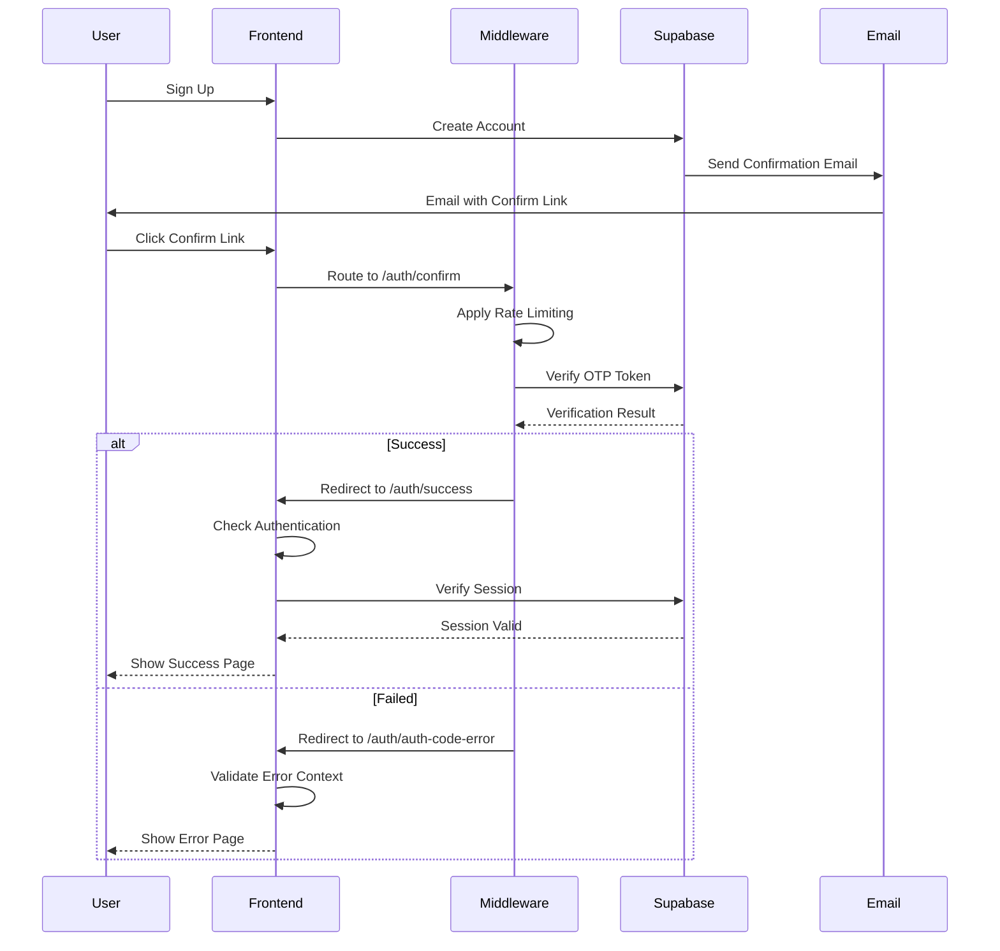
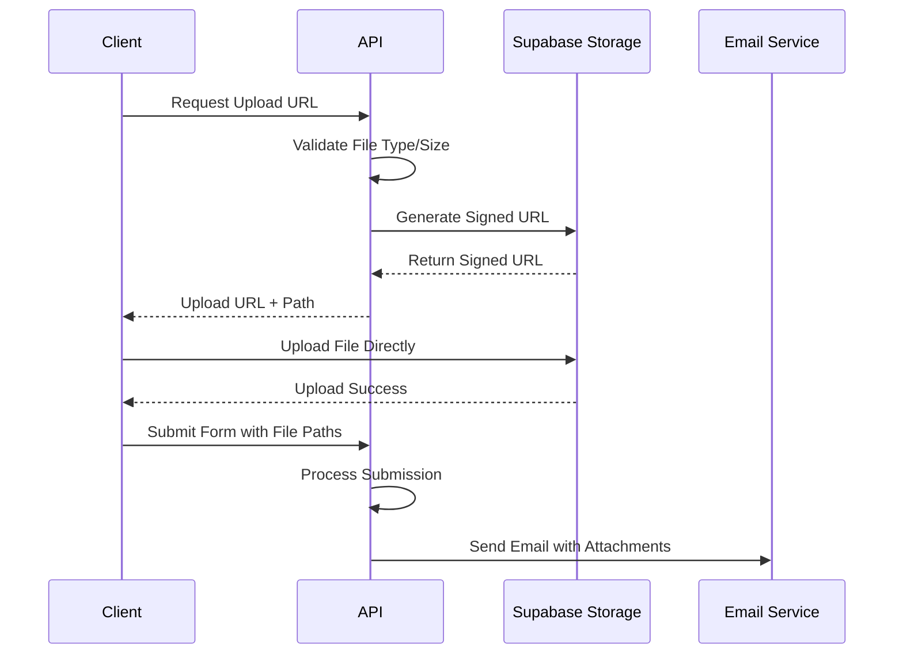
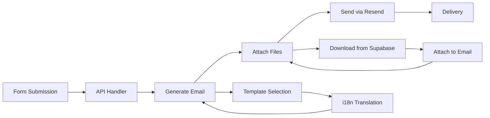
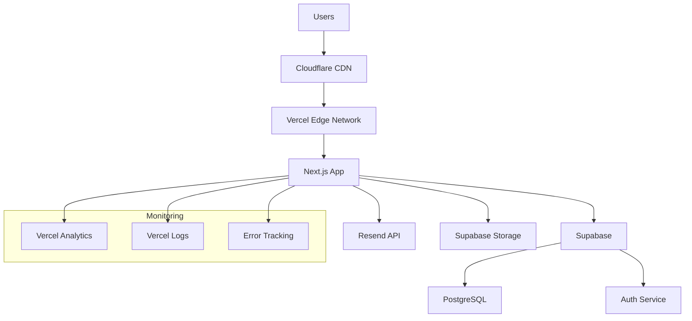

# Foxus Code Architecture Documentation

This document outlines the complete architecture of Foxus Code (灵狐快码), including system design, security architecture, data flow, and component relationships.

## Table of Contents
- [System Overview](#system-overview)
- [Security Architecture](#security-architecture)
- [Data Flow](#data-flow)
- [Component Architecture](#component-architecture)
- [Database Schema](#database-schema)
- [API Architecture](#api-architecture)
- [Authentication Flow](#authentication-flow)
- [File Upload Architecture](#file-upload-architecture)
- [Email System](#email-system)
- [Deployment Architecture](#deployment-architecture)

## System Overview

Foxus Code is a modern full-stack web application built with Next.js 15 App Router, featuring form creation, QR code generation, and email-based form submissions with file attachments.

### Technology Stack
```
Frontend:
├── Next.js 15 (App Router)
├── React 18
├── TypeScript
├── Tailwind CSS
├── Shadcn UI
├── React-i18next (Internationalization)
└── Zod (Validation)

Backend:
├── Next.js API Routes
├── Supabase (Database & Auth)
├── Resend (Email Service)
└── Node.js Runtime

Infrastructure:
├── Vercel (Hosting)
├── Supabase (BaaS)
├── Cloudflare (CDN - via Vercel)
└── GitHub (Version Control)
```

## Security Architecture

The application implements a comprehensive security model with multiple layers of protection:

### Authentication Security Flow



### Security Layers

1. **Middleware Security**
   - Route protection based on authentication status
   - Security headers (CSP, X-Frame-Options, etc.)
   - Rate limiting for sensitive endpoints
   - Request logging for security monitoring

2. **Authentication Security**
   - Server-side session validation
   - Client-side auth state management
   - Automatic redirects for unauthorized access
   - Token validation with format checking

3. **Page-Level Security**
   - Auth confirmation route with rate limiting
   - Success page with authentication validation
   - Error page with legitimacy checks
   - Input sanitization and validation

### Security Headers

```typescript
// Applied by middleware to all responses
const securityHeaders = {
  'X-Frame-Options': 'DENY',
  'X-Content-Type-Options': 'nosniff',
  'Referrer-Policy': 'strict-origin-when-cross-origin',
  'X-XSS-Protection': '1; mode=block',
  'Content-Security-Policy': `
    default-src 'self';
    script-src 'self' 'unsafe-inline' 'unsafe-eval' https://va.vercel-scripts.com;
    style-src 'self' 'unsafe-inline';
    img-src 'self' data: https:;
    font-src 'self' data:;
    connect-src 'self' https://*.supabase.co wss://*.supabase.co;
    frame-ancestors 'none';
  `
}
```

## Data Flow

### Form Creation Flow



### Form Submission Flow



## Component Architecture

### Frontend Components Hierarchy

```
src/
├── app/                    # Next.js App Router
│   ├── (auth)/            # Auth route group
│   │   ├── signin/        # Sign in page
│   │   ├── signup/        # Sign up page
│   │   ├── confirm/       # Email confirmation handler
│   │   ├── success/       # Auth success page
│   │   └── auth-code-error/ # Auth error page
│   ├── api/               # API routes
│   │   ├── forms/         # Form CRUD operations
│   │   ├── submit/        # Form submission handler
│   │   ├── storage/       # File upload utilities
│   │   └── auth/          # Authentication endpoints
│   ├── dashboard/         # Protected dashboard
│   ├── forms/             # Form management
│   │   ├── create/        # Form creation
│   │   ├── edit/[id]/     # Form editing
│   │   └── [id]/          # Form details
│   └── submit/[id]/       # Public form submission
├── components/            # Reusable components
│   ├── ui/               # Shadcn UI components
│   ├── forms/            # Form-related components
│   ├── auth/             # Authentication components
│   └── layout/           # Layout components
├── lib/                  # Utility libraries
│   ├── supabase.ts       # Supabase client
│   ├── auth.ts           # Auth utilities
│   ├── validations.ts    # Zod schemas
│   └── i18n.ts           # Internationalization
└── types/                # TypeScript definitions
```

### Core Components

1. **Form Builder**
   - Drag-and-drop interface
   - Field type selection
   - Validation rules
   - Preview functionality

2. **QR Code Generator**
   - Dynamic QR code generation
   - Customizable styling
   - Download functionality

3. **File Upload System**
   - Signed URL generation
   - Progress tracking
   - Multiple file support
   - Type validation

4. **Email System**
   - Template-based emails
   - Attachment handling
   - Internationalization support

## Database Schema

### Entity Relationship Diagram



### Data Types and Constraints

```sql
-- Form fields structure (JSONB)
{
  "id": "field_uuid",
  "type": "text|email|number|select|file|textarea",
  "label": "Field Label",
  "required": true|false,
  "options": ["option1", "option2"], -- for select fields
  "validation": {
    "min": 0,
    "max": 100,
    "pattern": "regex_pattern"
  }
}

-- Submission data structure (JSONB)
{
  "field_id": "submitted_value",
  "file_field_id": [
    {
      "name": "filename.pdf",
      "url": "storage_url",
      "size": 12345,
      "type": "application/pdf"
    }
  ]
}
```

## API Architecture

### RESTful API Endpoints

```
Authentication:
├── GET  /auth/confirm           # Email confirmation
├── POST /api/auth/signout      # Sign out

Forms:
├── GET    /api/forms           # List user forms
├── POST   /api/forms           # Create form
├── GET    /api/forms/[id]      # Get form details
├── PUT    /api/forms/[id]      # Update form
└── DELETE /api/forms/[id]      # Delete form

Submissions:
├── POST /api/submit            # Submit form
└── GET  /api/forms/[id]/submissions # Get form submissions

Storage:
├── POST /api/storage/upload-url # Get signed upload URL
└── GET  /api/storage/[file]    # Download file
```

### API Security

1. **Authentication**
   - Supabase JWT tokens
   - Row Level Security (RLS)
   - User session validation

2. **Authorization**
   - User-specific data access
   - Form ownership validation
   - Admin-only endpoints

3. **Input Validation**
   - Zod schema validation
   - File type restrictions
   - Size limitations

## Authentication Flow

### Complete Auth Flow Diagram



### Session Management

1. **Server-Side**
   - Supabase handles JWT tokens
   - Automatic token refresh
   - Secure cookie storage

2. **Client-Side**
   - React context for auth state
   - Automatic redirects
   - Loading states

## File Upload Architecture

### Signed URL Upload Flow



### File Storage Strategy

1. **Storage Structure**
   ```
   supabase-storage/
   ├── form-files/
   │   ├── form-attachments/
   │   │   ├── timestamp_random_filename.ext
   │   │   └── ...
   │   └── profile-images/
   │       ├── user_id/
   │       └── ...
   ```

2. **Security Measures**
   - Filename sanitization
   - File type validation
   - Size limitations
   - Virus scanning (future)

## Email System

### Email Architecture



### Email Templates

1. **Form Submission Email**
   - Dynamic content based on form fields
   - File attachments
   - Multilingual support

2. **System Emails**
   - Welcome emails
   - Password reset
   - Account notifications

## Deployment Architecture

### Production Infrastructure



### Environment Configuration

1. **Development**
   - Local Next.js server
   - Supabase development project
   - Local file storage

2. **Production**
   - Vercel hosting
   - Supabase production project
   - CDN for static assets

### Scaling Considerations

1. **Database Scaling**
   - Read replicas for heavy queries
   - Connection pooling
   - Query optimization

2. **Application Scaling**
   - Serverless functions auto-scale
   - CDN for static content
   - Image optimization

3. **Storage Scaling**
   - Supabase storage auto-scales
   - File compression
   - CDN integration

## Performance Optimization

### Frontend Optimizations

1. **Code Splitting**
   - Route-based splitting
   - Component lazy loading
   - Dynamic imports

2. **Caching Strategy**
   - Browser caching
   - CDN caching
   - API response caching

3. **Bundle Optimization**
   - Tree shaking
   - Minification
   - Compression

### Backend Optimizations

1. **Database**
   - Proper indexing
   - Query optimization
   - Connection pooling

2. **API Performance**
   - Response compression
   - Efficient serialization
   - Pagination

## Security Best Practices

### Application Security

1. **Authentication & Authorization**
   - Multi-factor authentication support
   - Role-based access control
   - Session timeout

2. **Data Protection**
   - Encryption at rest
   - Encryption in transit
   - PII data handling

3. **Infrastructure Security**
   - Security headers
   - HTTPS enforcement
   - Regular security updates

### Compliance Considerations

1. **Data Privacy**
   - GDPR compliance
   - Data retention policies
   - User data export/deletion

2. **Security Monitoring**
   - Access logging
   - Anomaly detection
   - Security incident response

## Monitoring and Observability

### Application Monitoring

1. **Performance Metrics**
   - Page load times
   - API response times
   - Error rates

2. **User Analytics**
   - User behavior tracking
   - Conversion funnels
   - Feature usage

3. **System Health**
   - Server uptime
   - Database performance
   - Third-party service status

### Alerting Strategy

1. **Critical Alerts**
   - Application downtime
   - High error rates
   - Security incidents

2. **Warning Alerts**
   - Performance degradation
   - Resource utilization
   - Failed email deliveries

## Future Architecture Considerations

### Planned Enhancements

1. **Microservices Migration**
   - Email service extraction
   - File processing service
   - Analytics service

2. **Advanced Features**
   - Real-time form collaboration
   - Advanced analytics
   - Form versioning

3. **Scalability Improvements**
   - Caching layer
   - Message queues
   - Load balancing

### Technology Evolution

1. **Framework Updates**
   - Next.js feature adoption
   - React 19 features
   - TypeScript improvements

2. **Infrastructure Modernization**
   - Container orchestration
   - Service mesh
   - Observability improvements

---

## Contributing to Architecture

When making architectural changes:

1. **Documentation Updates**
   - Update this document
   - Update code comments
   - Update API documentation

2. **Security Reviews**
   - Security impact assessment
   - Code security review
   - Penetration testing

3. **Performance Testing**
   - Load testing
   - Performance benchmarking
   - Scalability testing

For questions about the architecture or proposed changes, please create an issue or start a discussion in the repository.
